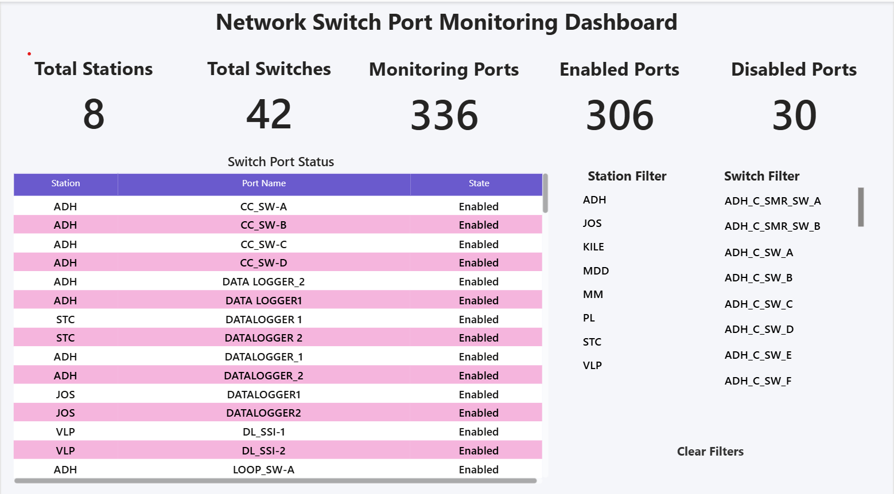

# 🌐 Network Switch Port Monitoring Dashboard (Power BI)

## 🔍 Quick Summary
Power BI dashboard designed to monitor network switch port status, failures, and infrastructure performance.

---

## 🛠 Tools Used
- Power BI  
- Excel  
- Data Visualization  

---

## 📈 Key Insights
- Port status (Active / Down)
- Failure tracking
- Infrastructure performance monitoring
- Site-wise analysis  

---

## 📊 Dashboard Overview

This dashboard provides a complete view of:

- Network health  
- Port activity  
- Failure detection  
- Performance insights  

---

## 🎯 Objective
To monitor network systems and quickly identify issues to reduce downtime.

---

## 💼 Business Impact

- Improves network monitoring  
- Helps detect failures faster  
- Reduces downtime  

---

🔗 Author: https://github.com/LTSGFH
